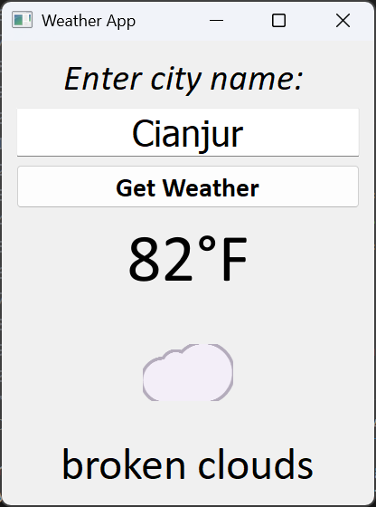

# 🌤️ Weather App Project

A simple desktop weather application built with **Python** and **PyQt5**. Users can enter a city name to view real-time weather conditions, including temperature, description, and weather-related emojis.

---

## 🖼️ Preview

<div align="center">
    
</div>

---

## ✨ Features

- Input city name
- Fetch current weather data from **OpenWeatherMap API**
- Display:
  - Temperature (in Fahrenheit)
  - Weather description
  - Emoji that matches the weather condition (☀, 🌧, ❄, etc.)
- Detailed error handling for various API and network issues

---

## 🛠️ Technologies Used

- Python 3
- PyQt5
- requests (for HTTP requests)
- OpenWeatherMap API

---

## ⚙️ How to Run

1. **Clone the repository:**

   ```bash
   git clone https://github.com/Rukadevata/Weather-App-Project.git
   cd Weather-App-Project

2. **Install the dependencies:**

    ```bash
    pip install PyQt5 requests

3. **Run the application:**

    ```bash
    python main.py

---

## 🔑 API Key

This app uses the <a href="https://openweathermap.org/">OpenWeatherMap API</a> to fetch weather data.

- An API key is already included in the code:

    ```bash
    api_key = "b1d7e1643e90969bf14eae24ae0d7da4"

> ⚠️ It’s highly recommended to replace the API key with your own to avoid rate limits or future issues.

---

## 📌 Additional Notes

- Weather emojis are mapped based on the **weather_id** from the API.
- Error handling covers: invalid input, network issues, invalid API keys, and server-side errors.
- Great for beginners learning how to integrate APIs, handle exceptions, and build desktop GUI apps with Python.

---

## 🚀 Potential Improvements

- Add Celsius temperature option
- Save last entered city
- Include official weather icons from OpenWeatherMap
- Display 3-day weather forecast